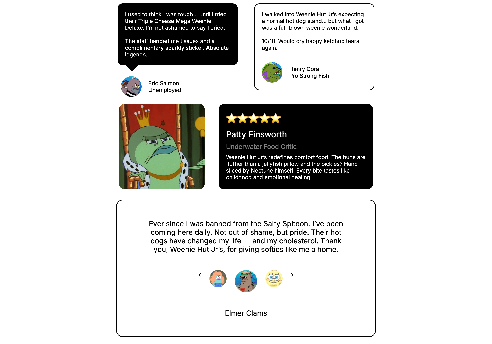

# 🧾 Testimonial Cards Project

A simple front-end project showcasing various testimonial card layouts using **HTML** and **CSS**. This project focuses on practicing **layout techniques**, **positioning**, and basic **responsive design** patterns.

---
## 📝 Project Brief
This project was based on a frontend layout challenge from roadmap.sh
Link to the original brief ← [(Replace this with the actual link when available.)](https://roadmap.sh/projects/testimonial-cards)

## 📸 Screenshot

<!-- Add your screenshot here -->

---

## 🚀 Features

- ✅ Multiple testimonial card styles
- ✅ Speech bubble with a triangle pointer
- ✅ Circular avatar image placeholders
- ✅ Flexbox-based layout with spacing and alignment
- ✅ Clean and minimal design with customizable content

---

## 🎯 Purpose

This project was built as part of a CSS learning exercise. The main objective was to:

- Practice layout and positioning using Flexbox
- Gain confidence with spacing, margins, and sizing
- Understand visual hierarchy in UI components

---

## 🛠️ Technologies Used

- HTML5
- CSS3 (Flexbox, positioning, border-radius, background images)
- Google Fonts (`Inter`)

---

## 📂 Folder Structure

project-folder/
│
├── index.html
├── styles.css
├── sb-headshot.jpg
├── Sandy.png
└── screenshot.png

---

## 💡 Learnings & Reflections

> _"This project helped me realize how much more confident I’ve become with CSS. What used to feel confusing is now more intuitive — and I was able to start building without needing much help. I can tell I’ve leveled up."_ — Joshua

---

## 📱 Next Steps (Optional)

- Make the layout fully responsive on mobile
- Add transitions or animations to elements
- Convert it into a reusable component for larger UI libraries

---

## 📖 License

Free to use for learning purposes or inspiration.